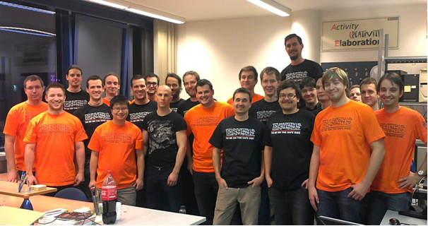
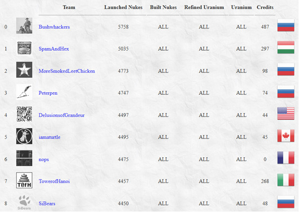

This is final part of this blog series. If you haven't done already so, you can read the 
[first](https://blog.avatao.com/How-SpamAndHex-became-top-hacker-team-1/) and 
[second part](https://blog.avatao.com/How-SpamAndHex-became-top-hacker-team-2/) of our story also. 
It was early 2013, in the middle of my PhD studies, when two master students (András Gazdag and Levente Fritz) asked 
me to talk about memory corruption vulnerabilities. It seemed to be a good idea, as there weren't any lectures about it 
on our university ([Budapest University of Technology and Economics](https://www.bme.hu))at that time.
 
<!--excerpt-->

I like approaching problems and tasks systematically, so preferred doing it on a regular basis by involving other interested 
students also. That was the point when we contacted Levente Buttyán to share our thoughts with. 
He liked the initiative very much, so we decided to invite the best students from previous years' Security Challenge. 
Fortunately, all the invited students joined us and a couple of weeks later we formed our learning group which we call 
CrySyS Student Core since then. 

It was a really great beginning, we have now many smart and interested students around us. The only thing we need is to 
make them even more interested. I've selected some topics that are appealing enough (e.g., memory corruption, 
virtualization security, malware analysis, reverse engineering, etc) and started to talk about the long, but amazing world
of system security to some excellent students week by week on a university aisle. Yes, we did not have a room at the beginning, but 
we had projector from the lab and a corridor wall to present my slides on. After around two months it was time to 
involve students to hold sessions. From this point on, we scheduled a speaker and a topic for our weekly events. After some time
we formalized our internal rules also. 

## CrySyS Student Core 
The CrySyS Student Core is an invite-only group of students from our university who feel enthusiasm for
various domains of IT security and who have already proven their aptitude. One way to get invited is to score
among the best students at our CrySyS Security Challenge, which is a hacking contest that we organize for our
students every year. Another way is to provide an impressive performance during a student semester project that
we supervise. Thus, students who get invited have already achieved something, and they have a certain
level of expertise in a specific IT security domain (e.g., reverse engineering programs, hacking web sites, or 
breaking cryptographic protocols). 

We meet once every week (including the holiday seasons), and discuss various topics in IT security. Very often, 
we prepare talks on topics that we have been studying or working on recently, and
present our experience to each other. For instance, a student would explain his discovery of a software bug and a
following exploit discovery. 

Another common activity is to prepare for international CTF games. This preparation usually means that the 
we give brief tutorials on various topics to each other, discuss write-ups for challenges from previous CTFs, 
or solve CTF challenges from previous years together. Occasionally, we invite an external expert to give a talk on a specific topic.

You can read more information about the talent management program at CrySyS Lab from [one of our recent 
 papers](http://www.crysys.hu/publications/files/ButtyanFP16ase.pdf). 

## Giving birth to !SpamAndHex

One measurable indicator of success is the steady improvement of our group’s results at international CTF’s. 
Before founding Student Core, we participated only the yearly iCTFs, and we didn't have a real track record on the global 
landscape of CTF teams. At that time, our team was called Team.iCTF.CrySyS.A in 2011 (ranked 36th) and Team.iCTF.CrySyS.B 
in 2012 (ranked 23rd). After founding Student Core in April, 2013 some students, for example, Dániel Bali, Tamás Koczka, 
Gábor Ács-Kurucz, Zsombor Lázár showed special interest in playing more CTF games. They participated on many-many online CTFs. 
After a couple of months, we knew that we need a team name to play with on international CTFs. We had many idea 
in our mind, but we finally concluded that !SpamAndHex is the best choice. Practically, 'Ham and eggs' was polished a bit.

In December 2013, we played again on iCTF as team !SpamAndHex for the first time with this name. We invited other students 
also from our university, but the key people of our team were all Student Core members. We tried our best, and we ranked 2nd. 
It was an amazing success for us. 
   

Tamas Koczka, for example, who later became the captain of !SpamAndHex
started to play CTFs almost every week. The results also came. 

From this point on, we continuously improved as a team which was also acknowledged by our global ranking on ctftime.org,
the world-wide ranking of all CTF teams. More precisely, we ranked 56th, 14th, and 5th in 2013, 2014, and 2015, respectively.

We came in 24th on the DEFCON CTF Qualifier in 2014, while they qualified at position 7 for the DEFCON CTF Finals in 2015 and position
10 in 2016.

Another good indicator of success is that many of the Core members got decent jobs at leading IT companies, including
  Google and Ericsson, as well as at successful Hungarian start-ups, including Prezi, Balabit, and Tresorit.

Our first year as !SpamAnd

